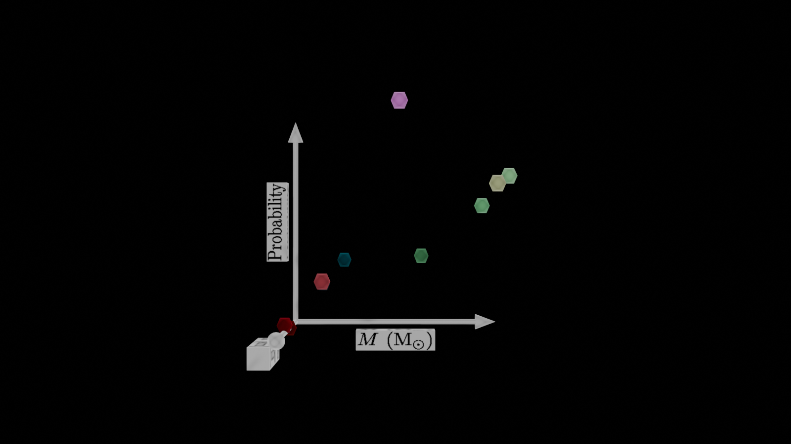
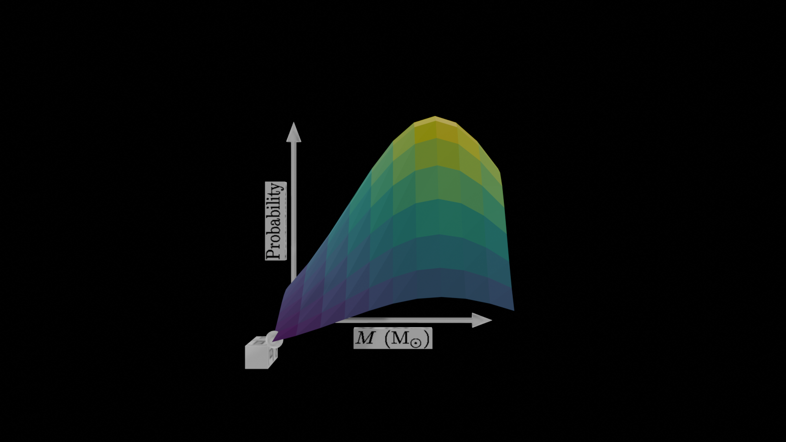

GLTF and Blender integration
============================

:ref:`O2sclpy <o2sclpy>`

O2graph has experimental support for writing 3D objects to GLTF files
and using Blender to perform some simple renderings of those 3D
objects. O2graph needs a working directory to store the relevant
textures and files, so typically one begins by setting the working
directory for the 3D-objects using ``-set td_wdir``.

One can create simple materials using ``-td-mat``, 
a surface from a table3d slice using ``-td-den-plot``, a scatter
plot from a table using ``-td-scatter``, an axis using ``-td-axis``,
axis labels set on rectangular prisms using ``-td-axis-label``,
an icosphere using ``-td-icos``, an arrow using ``-td-arrow``,
and a parallelogram using ``-td-pgram``. 

Sets of 3D objects can be written to a GLTF file using ``-gltf``.
GLTF files, in turn, can be viewed in Blender using ``-bl-import``.

The command ``-bl-yaw-mp4`` creates a MP4 file from a Blender
rendering of a set of 3D objects by rotating the camera around the
vertical axis. The command ``-bl-yaw-six`` is similar, but moves
the camera differently: it rotates in such a way as to show the
faces of all six sides of the cube aligned with the coordinate
axes. 

Internally, the scales of the 3D objects are set with the
variables ``xlo``, ``xhi``, ``ylo``, ``yhi``,
``zlo``, and ``zhi``. These can be set manually or if not, they are set
automatically by the first yt-related command. All commands work on
the user coordinate system by default, and then transform their
arguments to :math:`[0,1]` when necessary.

3D Scatter plot example
-----------------------

.. include:: ../examples/gltf_scatter_col.scr
   :literal:

3D Density plot example
-----------------------

.. include:: ../examples/gltf_den_plot_col.scr
   :literal:

The GLTF can be viewed in any GLTF reader, for example at
http://3dviewer.net/#model=https://github.com/awsteiner/o2sclpy/blob/dev/doc/static/gltf/den_plot_col.zip
.
           
Density plot movie
------------------

.. include:: ../examples/bl_den_plot_yaw.scr
   :literal:

.. raw:: html
	 
   <video width="512" height="288" controls><source src="https://awsteiner.org/code/o2sclpy-dev/_static/gltf/bl_den_plot_yaw.mp4" type="video/mp4"></video>
           
