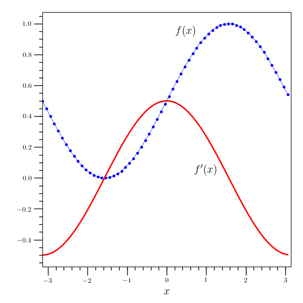
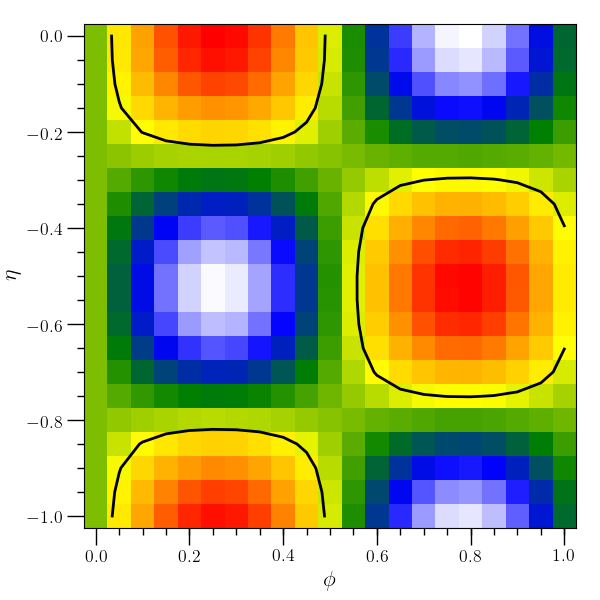
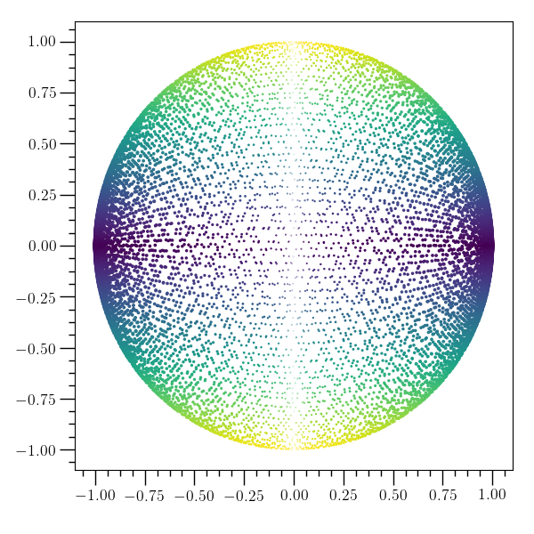
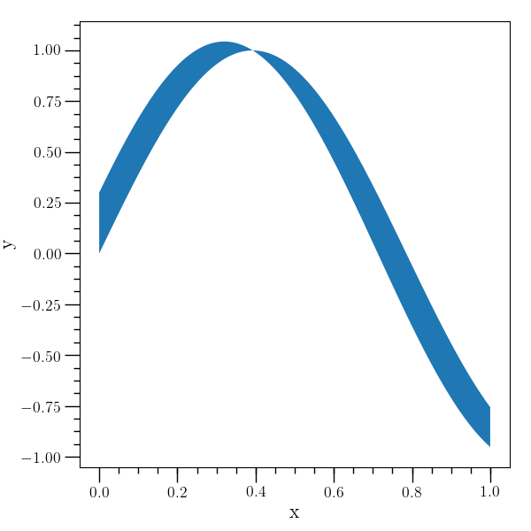

O2sclpy: v0.922
===============

.. toctree::
   :maxdepth: 2
   :caption: Contents:

O\ :sub:`2`\ sclpy: A set of python classes for use with the
O\ :sub:`2`\ scl C++ library (separately documented
at <https://isospin.roam.utk.edu/static/o2sclpy>)

.. warning:: This python library is highly experimental and under heavy
	     development.

The main objects of interest are the :ref:`O2graph script`, and the
classes :py:class:`o2sclpy.cloud_file`,
:py:class:`o2sclpy.hdf5_reader`, and 
and :py:class:`o2sclpy.plotter` .    

--------------------------------------------------------------
	     
O2graph script
==============

Sometimes it's helpful to be able to do some quick and dirty data
analysis without having to write python directly. The O\ :sub:`2`\
sclpy package includes a script called ``o2graph`` is designed to
enable quick analysis with text files or with HDF5 files generated by
O\ :sub:`2`\ scl. The O\ :sub:`2`\ graph script assumes that the O\
:sub:`2`\ scl library has been installed separately (with HDF5 support
enabled).

Installation and Requirements
-----------------------------

O\ :sub:`2`\ sclpy v0.921 can be installed with e.g. ``pip3 install
o2sclpy``. If you want to install the development version (v0.922), you can
clone the git repository, change directory to the O\ :sub:`2`\ sclpy
directory, and then use e.g. ``pip3 install .`` if you want
to use the pip package manager or ``python3 setup.py install``
to do a direct installation. O\ :sub:`2`\ sclpy requires
python3 packages ``h5py``, ``numpy``, ``matplotlib``. and requires
that 

The release version, O\ :sub:`2`\ sclpy 0.921, requires the O\
:sub:`2`\ scl v0.921 release from
<https://github.com/awsteiner/o2scl/releases/tag/v0.921> and the
development version, O\ :sub:`2`\ sclpy 0.922, requires that the most
recent version of O\ :sub:`2`\ scl from the master branch on github is
installed on your machine.

The script attempts to dynamically load the O\ :sub:`2`\ scl
libraries ``libo2scl`` and ``libo2scl_hdf`` using python's ctypes
module. If it cannot find them, you may need to use the argument
``-o2scl-libdir`` to specify the proper directory. If you're on OSX
and using GCC, the script must load the C++ library first, and if
necessary you can specify its location with the argument
``-o2scl-cpplib`` (on my OSX laptop this is ``-o2scl-cpplib
/usr/local/lib/gcc/7/libstdc++.dylib``).

Basic usage
-----------

The ``o2graph`` script is formulated along the same lines as the
``acol`` executable in O\ :sub:`2`\ scl documented at
<https://isospin.roam.utk.edu/static/o2scl/html/acol_section.html> .
It operates on one object at a time, and the basic workflow is
the same: read or create an object, manipulate and/or plot
that object, and save the object or the plot to a file.

Similar to ``acol``, the ``o2graph`` list of commands and help
screen changes depending on the type of the current object in
memory. Commands common to all types are listed in ``o2graph --help``
or ``o2graph --commands``. Commands applicable to objects of
O\ :sub:`2`\ scl type ``table`` are listed by ``o2graph --commands
table``. To obtain the help information on how a particular
command works with a particular type, add the type and the
command as arguments to help, e.g. ``o2graph --help table plot``,
which shows how to plot columns from ``table`` objects.

.. include:: static/o2graph.help.txt
   :literal:

Intergration with o2scl
-----------------------

The O\ :sub:`2`\ graph script implements all of the commands from the
``acol`` executable in O\ :sub:`2`\ scl documented at
<https://isospin.roam.utk.edu/static/o2scl/html/acol_section.html>
	     
Example 1
---------

.. include:: static/ex1.scr
   :literal:

Example 2
---------

.. include:: static/ex2.scr
   :literal:

Example 3
---------

.. include:: static/ex3.scr
   :literal:

Example 4
---------

.. include:: static/ex4.scr
   :literal:
.. image:: static/ex4.png
   :width: 70%

Example 5
---------

.. include:: static/ex5.scr
   :literal:

Example 6
---------

.. include:: static/ex6.scr
   :literal:

Internal structure
------------------

The O\ :sub:`2`\ graph script works by creating an instance of the
:py:class:`o2sclpy.o2graph_plotter` class and calling the function
:py:func:`o2sclpy.o2graph_plotter.parse_argv` . Internally, the
``o2graph_plotter`` class works by calling the global functions
mentioned in page
<https://isospin.roam.utk.edu/data/o2scl/html/o2scl_python_section.html>
in the O\ :sub:`2`\ scl documentation.
      
--------------------------------------------------------------
	     
O2sclpy classes
===============

.. module:: o2sclpy

Class cloud_file
----------------
	    
.. autoclass:: cloud_file
	:members:
	:undoc-members:

Class hdf5_reader
-----------------
	    
.. autoclass:: hdf5_reader
	:members:
	:undoc-members:

Class plotter
-------------
	    
.. autoclass:: plotter
	:members:
	:undoc-members:

--------------------------------------------------------------
	     
Other O2sclpy objects
=====================

.. autofunction:: default_plot
.. autofunction:: get_str_array
.. autofunction:: string_to_dict
.. autofunction:: parse_arguments
.. autodata:: version		  

--------------------------------------------------------------

Internal class
==============

Class plot_base
---------------------
 
.. autoclass:: plot_base
	:members:
	:undoc-members:

Class o2graph_plotter
---------------------
 
.. autoclass:: o2graph_plotter
	:members:
	:undoc-members:

--------------------------------------------------------------

Todo list
=========

.. todolist::
	   
--------------------------------------------------------------

Indices and tables
==================

* :ref:`genindex`
* :ref:`modindex`
* :ref:`search`
