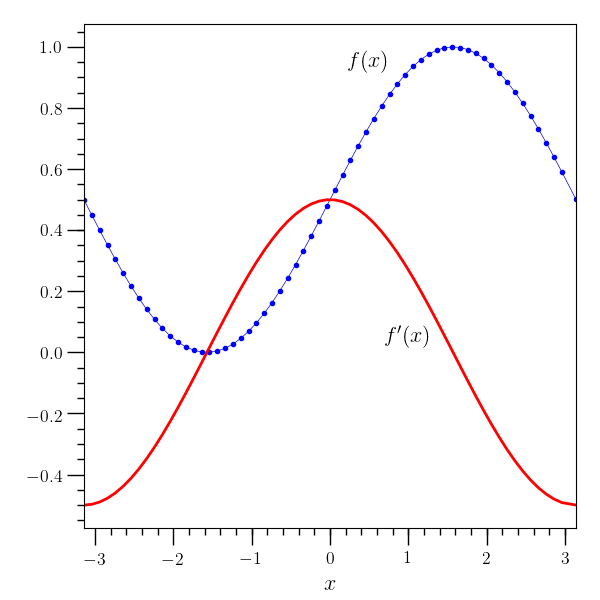
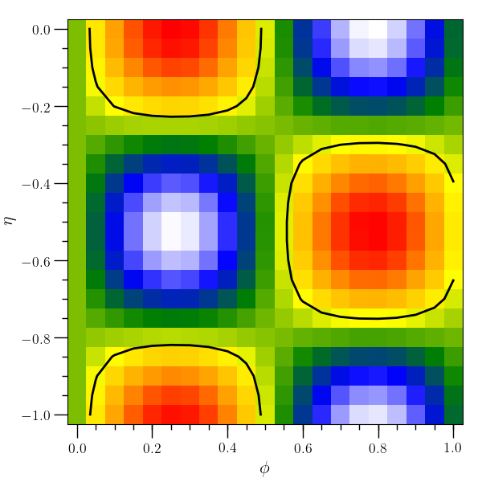
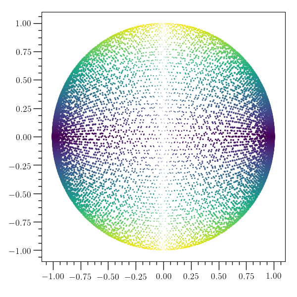
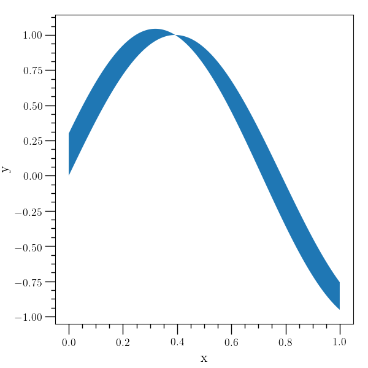

O2graph script
==============

Sometimes it's helpful to be able to do some quick and dirty data
analysis without having to write python directly. The O\ :sub:`2`\
sclpy package includes a script called ``o2graph`` which is designed
to enable quick analysis with text files or with HDF5 files
(especially those generated by O\ :sub:`2`\ scl). The O\ :sub:`2`\
graph script assumes that the O\ :sub:`2`\ scl library has been
installed separately (with HDF5 support enabled).

Basic usage
-----------

The ``o2graph`` script is formulated along the same lines as the
``acol`` executable in O\ :sub:`2`\ scl documented at
<https://neutronstars.utk.edu/code/o2scl/html/acol_section.html> .
It operates on one object at a time, and the basic workflow is
the same: read or create an object, manipulate and/or plot
that object, and save the object or the plot to a file.

Similar to ``acol``, the ``o2graph`` list of commands and help
screen changes depending on the type of the current object in
memory. Commands common to all types are listed in ``o2graph --help``
or ``o2graph --commands``. Commands applicable to objects of
O\ :sub:`2`\ scl type ``table`` are listed by ``o2graph --commands
table``. To obtain the help information on how a particular
command works with a particular type, add the type and the
command as arguments to help, e.g. ``o2graph --help table plot``,
which shows how to plot columns from ``table`` objects.

.. include:: static/o2graph.help.txt
   :literal:

Integration with o2scl
----------------------

The O\ :sub:`2`\ graph script implements all of the commands from the
``acol`` executable in O\ :sub:`2`\ scl documented at
<https://neutronstars.utk.edu/code/o2scl/html/acol_section.html>
	     
Example 1
---------

.. include:: static/table_plot.scr
   :literal:

Example 2
---------

.. include:: static/table3d_den_plot.scr
   :literal:

Example 3
---------

.. include:: static/backend.scr
   :literal:

Example 4
---------

.. include:: static/table_plotm.scr
   :literal:
.. image:: static/table_plotm.png
   :width: 70%

Example 5
---------

.. include:: static/table_scatter.scr
   :literal:

Example 6
---------

.. include:: static/table_rplot.scr
   :literal:

Internal structure
------------------

The O\ :sub:`2`\ graph script works by creating an instance of the
:py:class:`o2sclpy.o2graph_plotter` class and calling the function
:py:func:`o2sclpy.o2graph_plotter.parse_argv` . Internally, the
``o2graph_plotter`` class works by calling the global functions
mentioned in page
<https://neutronstars.utk.edu/code/o2scl/html/o2scl_python_section.html>
in the O\ :sub:`2`\ scl documentation.
      
