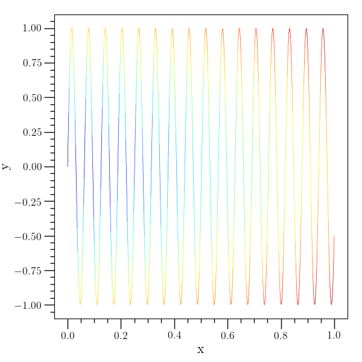
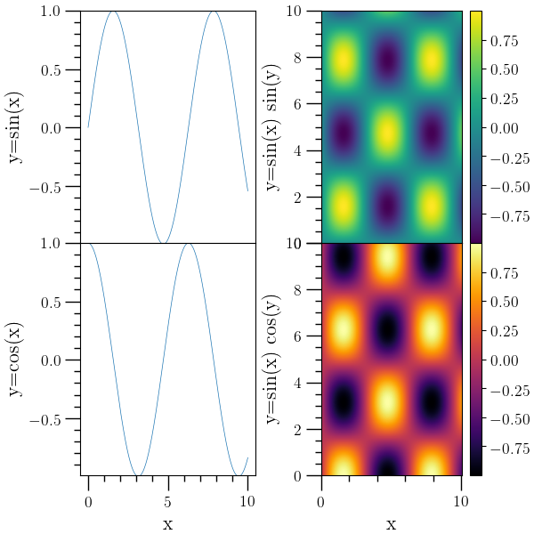

.. _o2graph_script:

O\ :sub:`2`\ graph script
=========================

Sometimes it's helpful to be able to do some quick and dirty data
analysis without having to write python directly. The O\ :sub:`2`\
sclpy package includes a script called ``o2graph`` which is designed
to enable quick analysis with text files or with HDF5 files
(especially those generated by O\ :sub:`2`\ scl). The O\ :sub:`2`\
graph script assumes that the O\ :sub:`2`\ scl library has been
installed separately (with HDF5 support enabled).

Basic usage
-----------

The ``o2graph`` script is formulated along the same lines as the
``acol`` executable in O\ :sub:`2`\ scl documented at ":ref:`o2scl:The
acol Command-line Utility`". It operates on one object at a time, and
the basic workflow is the same: read or create an object, manipulate
and/or plot that object, and save the object or the plot to a file.

Similar to ``acol``, the ``o2graph`` list of commands and help
screen changes depending on the type of the current object in
memory. Commands common to all types are listed in ``o2graph --help``
or ``o2graph --commands``. Commands applicable to objects of
O\ :sub:`2`\ scl type ``table`` are listed by ``o2graph --commands
table``. To obtain the help information on how a particular
command works with a particular type, add the type and the
command as arguments to help, e.g. ``o2graph --help table plot``,
which shows how to plot columns from ``table`` objects.

.. include:: static/o2graph.help.txt
   :literal:

Integration with O\ :sub:`2`\ scl
---------------------------------

The ``o2graph`` script implements all of the commands from the
``acol`` executable in O\ :sub:`2`\ scl documented at
":ref:`o2scl:The acol Command-line Utility`"
	     
First plot example
------------------

.. include:: static/examples/table_plot.scr
   :literal:
.. image:: static/figures/table_plot_doc.png
   :width: 70%

Density plot and contour line example
-------------------------------------

.. include:: static/examples/table3d_den_plot.scr
   :literal:
.. image:: static/figures/table3d_den_plot_doc.png
   :width: 70%

Agg backend example
-------------------

.. include:: static/examples/backend.scr
   :literal:

'plotv' example
---------------

.. include:: static/examples/table_plotv.scr
   :literal:
.. image:: static/figures/table_plotv_doc.png
   :width: 70%

Scatter plot example
--------------------

.. include:: static/examples/table_scatter.scr
   :literal:
.. image:: static/figures/table_scatter_doc.png
   :width: 70%

Region plot example
-------------------

.. include:: static/examples/table_rplot.scr
   :literal:
.. image:: static/figures/table_rplot_doc.png
   :width: 70%

Error bars example
------------------

.. include:: static/examples/table_errorbar.scr
   :literal:
.. image:: static/figures/table_errorbar_doc.png
   :width: 70%

plot-color example
------------------

.. include:: static/examples/table_plot_color.scr
   :literal:

Modifying axis example
----------------------

.. include:: static/examples/modax.scr
   :literal:
.. image:: static/figures/modax_doc.png
   :width: 70%

Subplot example 1
-----------------

.. include:: static/examples/subplots1.scr
   :literal:
.. image:: static/figures/subplots1_doc.png
   :width: 70%

Subplot example 2
-----------------

.. include:: static/examples/subplots2.scr
   :literal:

Subplot example 3
-----------------

.. include:: static/examples/subplots3.scr
   :literal:
.. image:: static/figures/subplots3_doc.png
   :width: 70%
	   
Internal structure
------------------

The O\ :sub:`2`\ graph script works by creating an instance of the
:py:class:`o2sclpy.o2graph_plotter` class and calling the function
:py:func:`o2sclpy.o2graph_plotter.parse_argv` . Internally, the
``o2graph_plotter`` class works by calling the global functions
mentioned in the :ref:`o2scl:Python Integration` page in the in the O\
:sub:`2`\ scl documentation.
      
