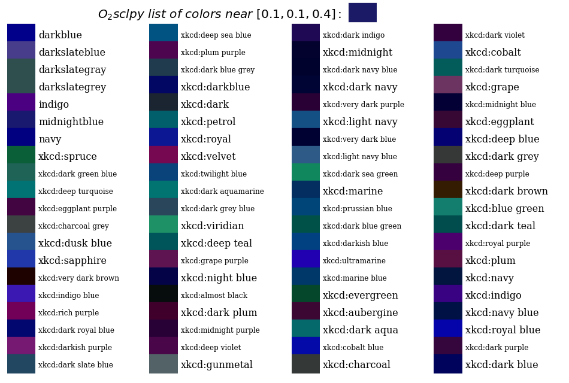

Plot reference
==============

:ref:`O2sclpy <o2sclpy>`

Color names and RGB values
--------------------------

To obtain a list of matplotlib native and CSS4 color names along with
their RGB values in hexadecimal, use `-help colors`. This help topic
also gives some guidance on specifying colors in o2graph scripts. To
plot the CSS4 colors, use `-help colors-plot`.

Nearby colors
-------------

To obtain a list of colors near (in RGB space) a specified color, use
`o2graph -help colors-near <color>` where `<color>` is a named
`matplotlib` color, a HTML-like hexadecimal color, or an array
`(r,g,b)` with entries between 0 and 1. To output the plot to a
filename, use `o2graph -help colors-near <color> <filename>`. To avoid
the generation of a `matplotlib` window, choose the Agg backend first:
`o2graph -backend Agg -help colors-near <color> <filename>`.

.. include:: ../examples/colors_near.scr
   :literal:

.. image:: static/figures/near_hex.png
   :width: 70%

Colormaps
---------

To obtain a quick summary of matplotlib and o2sclpy colormaps, use
`-help cmaps` for a list or `-help cmaps-plot [filename]` for a plot,
e.g.

.. include:: ../examples/cmaps.scr
   :literal:

Markers
-------

To obtain a quick summary of matplotlib markers, use `-help markers`
for a list or `-help markers-plot [filename]` for a plot, e.g.

.. include:: ../examples/markers.scr
   :literal:

