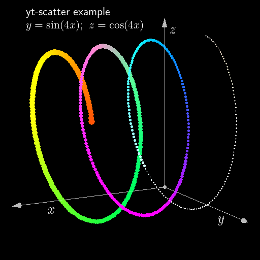

yt integration
==============

:ref:`O2sclpy <o2sclpy>`

O2sclpy uses yt to perform 3D volume renderings. A volume rendering
can be built upon a O\ :sub:`2`\ scl tensor_grid object using
``yt-add-vol``. A 3D scatter plot can be created from an O\ :sub:`2`\
scl table object using ``yt-scatter``. A set of line segments can be
plotted using ``yt-vertex-list``. 

The volume renderings currently only work with the Agg backend, so if
any yt commands are found then the Agg backend is automatically chosen
by ``o2graph``. Mixing 2D and 3D plots with ``o2graph`` is not well
documented or supported (even if they both use the ``Agg`` backend).

Internally the limits on the volume rendering are always :math:`[0,1]`
for all three axes. The variables ``xlo``, ``xhi``, ``ylo``, ``yhi``,
``zlo``, and ``zhi`` control the limits of the volume in the "user
coordinate system". These can be set manually or if not, they are set
automatically by the first yt-related command. All commands work on
the user coordinate system by default, and then transform their
arguments to :math:`[0,1]` when necessary.

During animations, yt text objects will be reoriented to ensure they
are parallel to the camera and upright if the keyword argument
``reorient=True`` is given.

Annotations to volume visualizations can be constructed from normal 2D
o2graph plotting commands, and in this case the coordinate system for
the 2D annotations is set to be :math:`[0,1]` in both width and height, so
that the lower left corner of the image is :math:`(0,0)`.

yt scatter example
------------------

.. include:: ../examples/yt_scatter.scr
   :literal:

yt multiple volume example
--------------------------

.. include:: ../examples/yt_tg_multvol.scr
   :literal:	     

.. raw:: html
	 
   <video width="512" height="512" controls><source src="https://awsteiner.org/code/o2sclpy/_static/yt_tg_multvol.mp4" type="video/mp4"></video>

